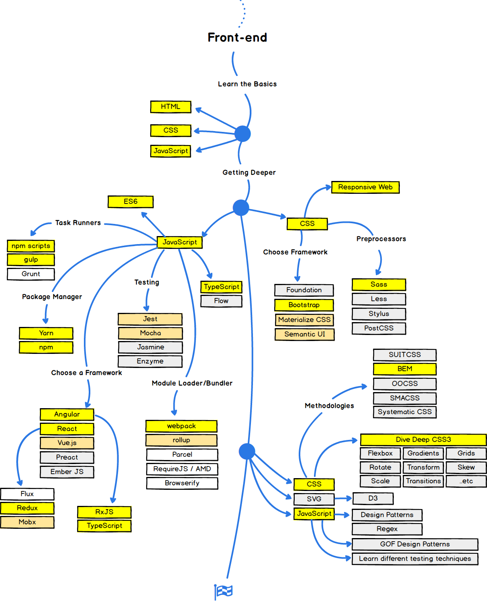

# Intro to HTML and CSS:


The purpose of this workshop is to introduce you to the core fundamentals of web development. This course is only one hour long so we won't be able to cover everything, but wherever possible I'm going to try and add as many extra resources for you all to continue your learning after this course is over. 

with the fundamentals you learn here today, you should all be able to make simple web projects, or make a homepage to showcase your project and / or team. 

As you can see from the set of skills you need to learn to become a Front-end developer, HTML, CSS, and JavaScript make up the very first skill set you need. They act as the foundation layer that everything else rests on. 

<figure><figcaption>Web Developer Roadmap: Source = https://github.com/kamranahmedse/developer-roadmap</figcaption></figure>


## Getting Started

Web programmers usually code in something called a text editor. If you already have a text editor installed please use that for this lecture.

If you don't have one yet, to save time, you can follow along using [jsbin.com](https://jsbin.com/?html,css,js,output) which will let you code online. Make an account when you're finished to save your project. 

While you make your hackathon project, I recommend that you use a real text editor and not jsbin. I use [Visual Studio Code](https://code.visualstudio.com/) which is free and open sourced. Other popular choices are [Sublime Text](https://www.sublimetext.com/), or [Atom](https://atom.io/). If you're not sure which to use just go ahead and download VS Code - you can always change later. 


## What Is A Webpage

I think most people have a good understanding of what a webpage is. It's a page that's accessible at some address (or URL) i.e. `www.google.com` that you view through a special program called a web browser (i.e Chrome, Firefox, Safari etc.) 

But what goes into a webpage? What makes it different than a word document, or a pdf?

If you have clicked the link for [jsbin](https://jsbin.com/?html,css,js,output) you'll see three panels - HTML, CSS, and JavaScript. This is a good clue as to what makes up a web

**HTML** stands for Hyper Text Markup Language. It's not strictly a programming language, but more of a way to structure text and information on a page. You create the basic building blocks of your site with HTML

**CSS** stands for Cascading Style Sheets. This is used to apply styles, such as colours / layouts / typefaces etc. to the basic building blocks. 

**JavaScript** is an actual programming language that is used to make your HTML and CSS dynamic. It controls events - such as "when this box is clicked add something to the page" We won't have time to get into javascript for the purposes of this lecture but I will include some resources towards the bottom


## HTML BASICS:

If you're using a text editor, make a new folder called `website`. in your `website` folder make a new file called `index.html` (by convention the main landing page of a website is often called index). Now in index.html copy and paste the following:


```
<!DOCTYPE html>
<html>
	<head>
	  <meta charset="utf-8">
	  <title>Awesome Webpage</title>
	</head>
	<body>
	
	</body>
</html>
```

The way HTML works is things are placed between tags. Tags are follow the pattern of:

`<p>` what the tag is applied to `</p>`


`<p>` means opening tag of type p (paragraph), and `</p>` means closing tag of type paragraph. Whatever goes between those tags is understood by the browser to mean "this is all a paragraph" 

Don't worry too much about the html posted above. Those tags just set up the document and tell it that it's an html document. 
Everything in the <head> </head> tag tells the web page how to behave, and everything in the <body> </body> is what is actually going to be displayed. 

So - lets add some content to our page. In between the `<body>` `</body>` tags add:

`<h1> Hello World! </h1>`

h1 stands for Headline 1. 
HTML can use headlines h1-h6 where h1 is used for the big important stuff, and h6 is used for smaller things. to see what these look like Add this between the `<body>` tags:


`<h1> Hello World! </h1>`

`<h2> Hello World! </h2>`

`<h3> Hello World! </h3>`

`<h4> Hello World! </h4>`

`<h5> Hello World! </h5>`

`<h6> Hello World! </h6>`

then view your index.html file in your browser. To do this either right click the file in vscode and select `open in default browser` or simply navigate to your index.html file and double click on it and it will open in your browser. 


Ok - now let's erase those titles and create a simple web-page with what we've learned so far. I'm going to make a website for myself:


```HTML
<!DOCTYPE html>
<html>

<head>
	<meta charset="utf-8">
	<title>Adriel's Homepage</title>
</head>

<body>
	<h1> Adriel Arsenault </h1>
	<h2> About Me </h2>

	<p> I'm a Web Developer currently living in Montreal Quebec. 
	Before becoming a programmer I studied physics and literature.
	In my spare time I like to make music and teach people how to code! </p>

	<h2> Skills </h2>
	
	HTML <br>
	CSS <br>
	Javascript <br>
	Python <br>

</body>

</html>
```


Notice that I had to put in some `<br>` i.e. "line break" tags to format my skills section correctly. In an HTML document, and most programming languages too, all white space such as spaces and new lines are ignored! Keep that in mind when trying to format your text. Also notice that unlike the other tags there is no closing tag. This is because the break doesn't modify any text that would go between the tags, but modifies the page structure itself. 

**Note**: 
Notice we use indentations to keep things organized. The `<title>` tag is is indented from `<head>` tag. This doesn't affect how anything is rendered but will help you a lot to read and organize your code! 


### More important tags:

####* `<em>` 

stands for emphasis and will italicize a word

`<em>` example `</em>`: 

<em> example </em>

####* `<strong>` 

Will bold the words between tags

`<strong>` example `</strong>`:
 
<strong> example </strong>

These tags can be combined as well i.e. having an  `<em>` tag inside a sentence that is all bold. Try it!

####* `<ul>` and `<li>` 

Will make an ***u**nordered **l**ist*:

```
<ul>
	<li> a thing </li>
	<li> another thing </li>
	<li> wow more things </li>
	<li> enough things </li>	
</ul>
```

gives:


<ul>
	<li> a thing </li>
	<li> another thing </li>
	<li> wow more things </li>
	<li> enough things </li>	
</ul>


similarly 

####* `<ol>` and `<li>` 

Will make an ***o***rdered **l**ist*:

```HTML
<ol>
	<li> First thing </li>
	<li> Second thing </li>
	<li> Third thing </li>
	<li> Fourth thing </li>	
</ol>
```


gives:

<ol>
	<li> First thing </li>
	<li> Second thing </li>
	<li> Third thing </li>
	<li> Fourth thing </li>	
</ol>


####* ``

will allow you to add images to your website. However you need to add an **attribute** to the tag which tells it where the **source** for the image is 


``

creates:


here `src`, `alt`, and `width` are all attributes that we pass to the image. `alt` is the *alternative* text for an image that displays when the image itself can't be displayed and is used for screen readers for the blind. `width` controls how big the image will be. We'll see more about how to do more complex styling with CSS in a bit. 


####* `<a>`

The a tag stands for **anchor**. While the name is a little obscure, what it does is what create a link. Between the a tags we write the text we wish to display and the href attribute (stands for hyper reference) is the address we'd like to link to. 

`<a href="https://www.linkedin.com/in/adrielarsenault/"> See my LinkedIn </a>`

creates:

<a href="https://www.linkedin.com/in/adrielarsenault/"> See my LinkedIn </a>


note that just as you can combine other tags, you can put images or whole paragraphs between `<a>` tags so that they become clickable! 

#### * `<!-- -->`

This is a special type of tag that represents a comment. Anything between the dashes will **not** be rendered by the browser. So this:

`<!-- Hello world -->`

creates:


... nothing! 


Comments are a good way to leave yourself notes in your HTML about what certain pieces of code may be doing, your thought process or if you wish to temporarily remove something to test what your site looks like without it - but don't want to permanently delete it - you can wrap it in a comment. 

These represent the basic html tags that you'll be using a majority of the time. For a complete list of all the different HTML tags you can go to [w3schools](https://www.w3schools.com/tags/default.asp). This is a great resource and will get you accustomed with reading documentation for libraries and frameworks - this actually a huge part of what programmers do on a day to day basis. Don't worry if you don't understand everything you read here though! Often times documentation covers a lot of very specialized things that you won't need to use the majority of the time. 

___

###Exercise 1:

Create a version of a personal website for yourself! You can create whatever headings / sections you like and fill it in with some information about yourself. You can add some lists of your skills or projects, add a profile picture with ``, and add some links to your LinkedIn or other social media with `<a>` tags. 
___


<!-- todo: build this out for self -->


## CSS Basics:

Now that we have a website that we has some information about ourself, we want to start styling it to make it look less bland. 


Go back to the top of your homepage and add a `<style>` tag in the header

```HTML
<!DOCTYPE html>
<html>

<head>
	<meta charset="utf-8">
	<title>Adriel's Homepage</title>
	<style>
	
	</style>
</head>

<body>

...
```


Now in the style tag we want to change it so the colour of all our h2 tags is red. to do that we type:


```HTML
<!DOCTYPE html>
<html>

<head>
	<meta charset="utf-8">
	<title>Adriel's Homepage</title>
	<style>
		h2 {
			color: rgb(230, 0, 92);
		}
	
	</style>
</head>

<body>

...
```

colours can be given as rgb values (red, green, blue), or as hexadecimal values. You can use a [colour picker](https://www.w3schools.com/colors/colors_picker.asp) to help you choose the right values. 

the **h2** before the curly braces is the selector that your CSS rule (i.e, turn it red) is being applied to. This means that *all* h2 headings on your page will now be red. You can do the same thing for most html tags, such as p, body, a, etc. 

**Note1** you *must* use the curly braces and also add the ; after each rule within the curly braces. This is just the arbitrary syntax that lets the browser know you are writing CSS rules. If something doesn't work, first check to make sure you've got this syntax correct. 


Now, change the background of your page by adding this to your `<style>` tag

```
		body {
			bacground-color: rgb(204, 255, 255);
		}
```	


* Selecting by tag name, id and class

So now we can control how to add CSS styling to all Headers, or paragraphs etc. but what if we want to give a certain colour to just one? For instance in the example below we have two paragraphs and we want to change the background colour only for the first one:


```HTML
<!DOCTYPE html>
<html>

<head>
	<meta charset="utf-8">
	<title>Adriel's Homepage</title>
	
		<style>
		h2 {
			color: rgb(230, 0, 92);
		} 
	
	</style>
</head>

<body>
	<h1> Adriel Arsenault </h1>
	<h2> About Me </h2>

	<p> I'm a Web Developer currently living in Montreal Quebec. 
	Before becoming a programmer I studied physics and literature.
	In my spare time I like to make music and teach people how to code! </p>

	<h2> Skills </h2>
	
	<p> My skill include programming in javascript and python,
	 web and software development, and fixing bicycles </p>
	


</body>

</html>
``` 

To do that we'll need create an id for an element like so: 

```HTML
<!DOCTYPE html>
<html>

<head>
	<meta charset="utf-8">
	<title>Adriel's Homepage</title>
	
		<style>
		h2 {
			color: rgb(230, 0, 92);
		}
		
		#about-me-paragraph {
			background-color: rgb(153, 255, 153);
		}
	
	</style>
</head>

<body>
	<h1> Adriel Arsenault </h1>
	<h2> About Me </h2>

	<p id="about-me-paragraph"> I'm a Web Developer currently living in Montreal Quebec. 
	Before becoming a programmer I studied physics and literature.
	In my spare time I like to make music and teach people how to code! </p>

	<h2> Skills </h2>
	
	<p> My skill include programming in javascript and python,
	 web and software development, and fixing bicycles </p>
	


</body>

</html>
``` 

It's important to note that making an ids for tags must be unique! If you style something by using an id the purpose is to only style a single html element. 


If you want to style more than one thing, i.e a few paragraphs but not *all* paragraphs you can create a class and use that as a CSS selector. 

Creating a class selector is similar to creating an id. You first add an attribute to the tag like so:

`<p> class="bio-info"> blah blah blah blah 
</p>`

and style the class, but instead of a `#` you use a `.`

```
	<style>
	
		<!-- Selecting ALL h2 headings-->
		h2 {
			color: rgb(230, 0, 92);
		}
		
		<!-- Selecting by unique ID-->
		#about-me-paragraph {
			background-color: rgb(153, 255, 153);
		}
		
		<!-- Selecting by Class -->
		.bio-info {
			background-color: rgb(100, 100, 153);

		}
	
	</style>
```


**Note!** class and Id names are case and spelling sensitive! They also don't accept spaces, so it's best to use `-` to separate words

* Fonts

```
	<style>
	
		p {
			font-family: "Helvetica", sans-serif; 
		}
	</style>

```

When we write `"Helvetica"` we are are specifying an explicit font, however by writing `sans-serif` we are telling the browser "if Helvetica font is not found in the user's client, then fall back to their system's default sans-serif font. 


Try changing the font size by playing with the `font-size` property

```
	<style>
	
		p {
			font-family: "Helvetica", sans-serif; 
			font-size: 14px;
		}
	</style>

```

For more info on Fonts and how to use them see the [w3schools](https://www.w3schools.com/css/css_font.asp) reference 


* Layout

___

###Exercise 2:

Style the rest of your website using CSS. Add Backgrounds / Typefaces and section colours to make your site look the way you want.  
___


## Hosting a Static Site with Github-Pages:

* Explanation of what Github is
* How to make a Github account
* How to have Github host your static website 


## Where to go from here:

#### Bootstrap

* Brief explanation of what bootstrap is and how to use it
* [getbootstrap.com](https://getbootstrap.com/) <br>


#### Javascript

* Brief Explanation of how javascript makes pages dynamic 


## Resources to Broaden your knowledge! 

 
##### Extra Github Resources:

[Interactive Github Tutorial](https://try.github.io/levels/1/challenges/1) <br>
[Git-hub walkthrough](https://guides.github.com/activities/hello-world/) <br>
[Udacity: How to use git and Github](https://www.udacity.com/course/how-to-use-git-and-github--ud775)


##### References / Documentation 

When you're not sure how to do something, often times it's

[w3schools CSS reference and tutorials](https://www.w3schools.com/css/default.asp)

[w3schools HTML reference and tutorials](https://www.w3schools.com/html/default.asp)


##### Online HTML / CSS Courses:

[Udacity: intro to HTML/CSS online course](https://in.udacity.com/course/intro-to-html-and-css--ud304) <br>
[Kahn Academy: Intro to HTML/CSS](https://www.khanacademy.org/computing/computer-programming/html-css/intro-to-html/v/making-webpages-intro) <br>
[Codecademy: Interactive HTML-CSS lessons](https://www.codecademy.com/catalog/language/html-css)

##### Interesting links:
[CSS Zengarden - examples of how you can use CSS to make totally different sites from the same HTML](http://www.csszengarden.com/214/)

##### Learning JavaScript:
[Wes Bos: Javascript 30](https://javascript30.com/) <br>
[Codecademy: intro to javascript](https://www.codecademy.com/learn/introduction-to-javascript)
